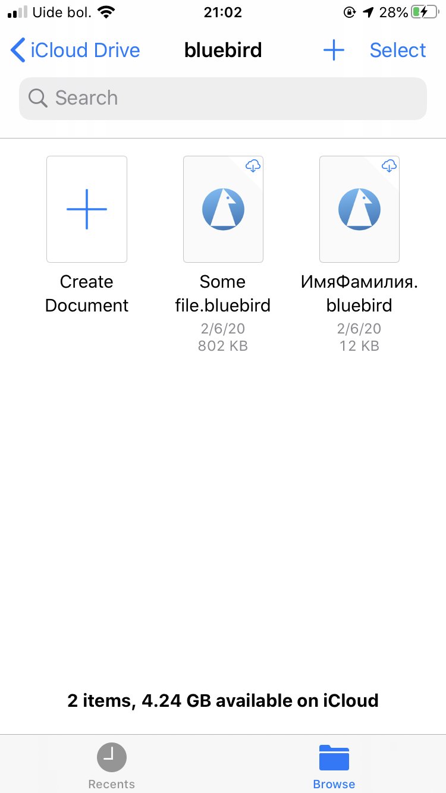
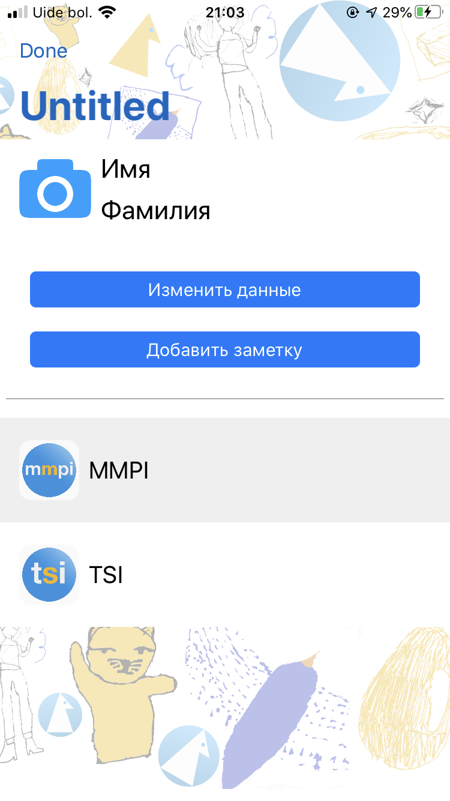
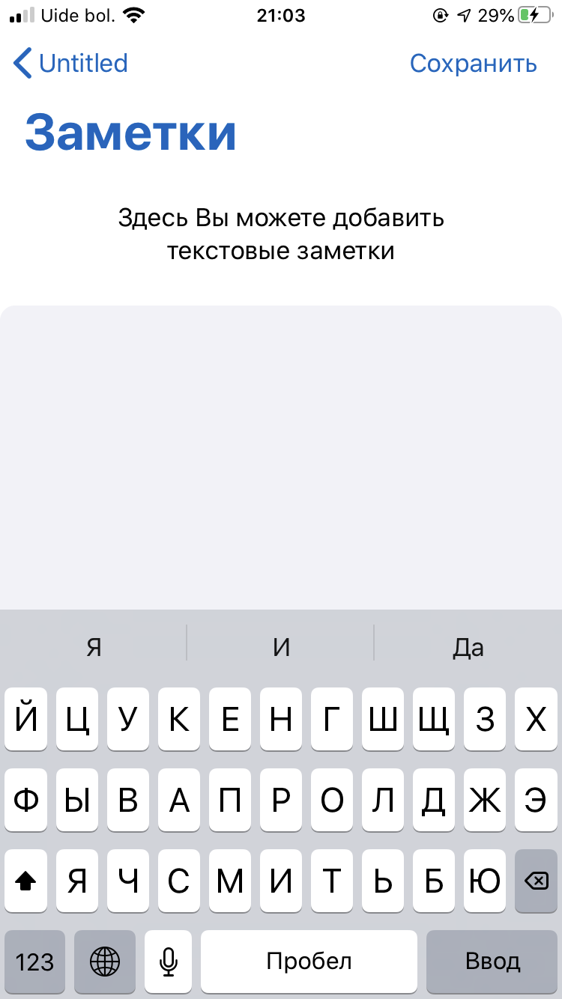
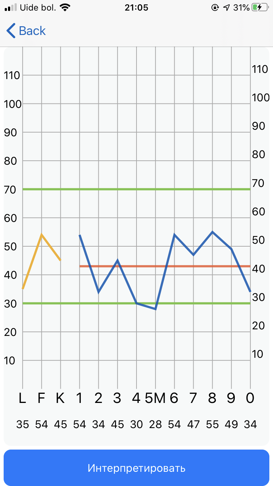
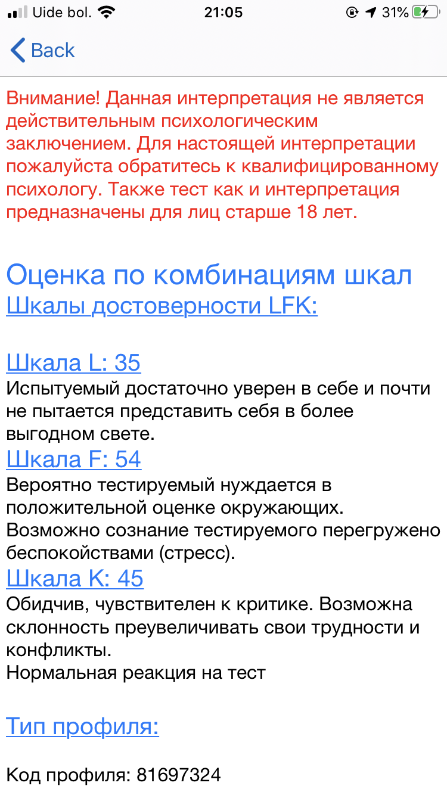

# bluebird

### About

The project is an attempt to automate the process of psychological screening. The app is based on 377 MMPI test questions as well as interpretations of experts in the field. The language of the app is Russian.

In the app users can take MMPI test and get its interpretation, or insert the result of previously taken test to get the interpretation.

This is a document based app, the data is persistent. Blow you can see short descriptions of each view

#### Document View

This is the first view that user sees upon entering the app. He/she can create a new document to start work.

  

#### Main Menu

This view appears when user enters or creates the document, here you can chose to edit user data or enter a test menu

  

#### Notes View

Here you can add notes about this user

  

#### User Data View

A basic user info such as name, gender and age can be entered here

  

#### Questions View

On this view a user can take a test, it has several buttons, labels and completion indicator

  

#### Result View

After taking the test or inserting results of previous test user is redirected to this results view. Lines are drawn using _UIBezierPath_s

  

#### Interpretation View

This view shows the interpretation of users' results

  

